**Process Advisor & Importing Solution**

**⏱️ The estimated time to complete this lab is 2 hours 30 minutes.**

**Scenario**

In this lab, you will be working to design the automation of a Construction Loan
Funding process that is currently manually tracked by Relecloud staff.

**High-level lab objectives**

-   Discover the current process

-   Use Process Advisor to visualize and analyze the current process

-   Evaluate automation options

-   Design the automation of the process

-   Import and review the starter solution

**Exercise \# 1 – Discover Current Process**

In this exercise you are going to get to know the current manual process.

**Task 1: Review the process scenario**

The following companies or people are involved in the process you will be
automating.

| **Company or people** | **Description**                                                                                                                             |
|-----------------------|---------------------------------------------------------------------------------------------------------------------------------------------|
| Borrower              | Borrows money from bank to build a house.                                                                                                   |
| Builder               | Has an agreement to build house for Borrower and gets paid as the house is built by Loan Draws from the borrower’s loan.                    |
| Woodgrove Bank        | Loans borrower money to build house, hires Relecloud to manage the construction loan draw funding as the house is built by the builder.     |
| Relecloud             | Escrow company that manages the process for the bank. They do all the manual work today and this is who you are automating the process for. |
| Fabrikam Inspections  | An inspection company that goes on site to verify and provide proof of work completed.                                                      |
| A Datum               | A risk management company that helps banks reduce losses from bad loans. They provide a risk score used in the process.                     |

The following describes the current manual process:

Woodgrove Bank does construction loans to builders to build homes. Woodgrove
does not give all the loan money to the builders on initial approval they only
give it as construction progresses. Each month, builders can request loan funds
(a draw) for the progress made and funds spent during the last month.

Woodgrove is too busy to manage the process, so they hired Relecloud to manage
it. Each month builders email forms requesting funds to Relecloud. After review,
Relecloud requests Fabrikam Inspections via their website to do an onsite
inspection to verify the work stated was actually done.

Once the inspection is completed, Relecloud does a risk check using a website A
Datum has that confirm that the builder hasn’t become high risk. After these
checks, Relecloud uses a Windows form app provided by Woodgrove to request
funding. Someone from Relecloud checks the app each day for any completed
requests and then they notify of funding completed.

Today Relecloud does each process step manually. You have been asked if you can
improve the process by automating some of the process.

**Task 2: Review the draw request form**

1.  Go to the lab resources folder and open the Draw1-MC3747.pdf file.

2.  Review the form.

3.  This form is completed for each draw by the builder and emailed to
    Relecloud.

**Task 3: Review the loan tracking Excel file**

1.  Go to the lab resources folder and open the LoanTracking-MC3747.xlsx file.

2.  Review the loan tracking file.

3.  Relecloud staff creates one of these worksheet files for each loan and uses
    it to track the draws on the loan.

**Exercise \# 2 – Use Process Advisor with Data**

In this exercise, you will create a process advisor from existing process data
and review the analytics.

**Task 1: Create process advisor**

1.  Navigate to https://make.powerautomate.com and select **Get started** to
    dismiss the welcome prompt, if necessary.

2.  Select the **Dev One** environment from the **Environment** drop-down.

3.  Select **Process mining** from the left navigation pane and select **+ Start
    here**.

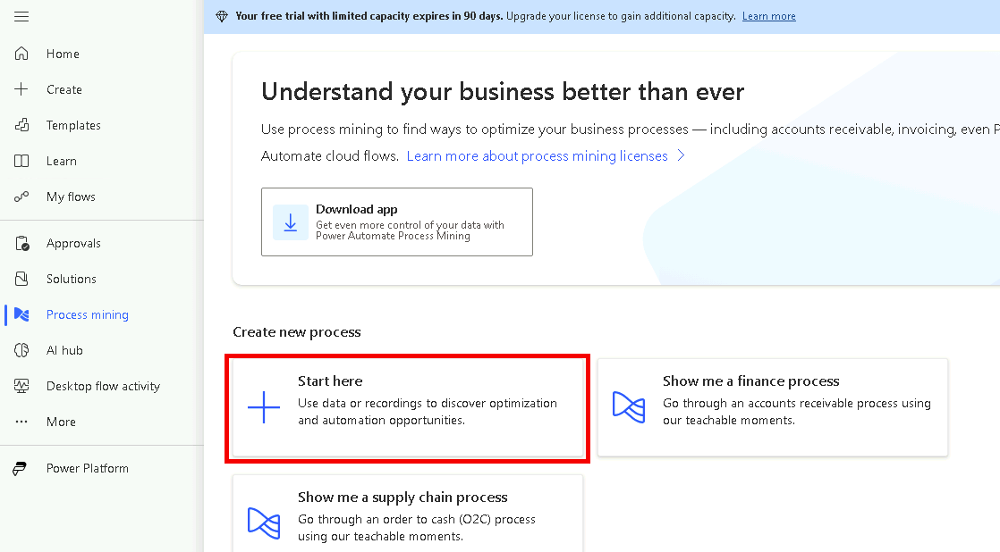

1.  Enter Loan Funding - Data for **Process name** and select **Continue**.

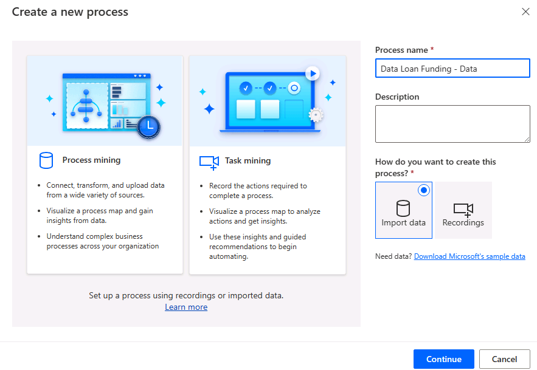

1.  Select **Excel workbook**.

2.  Select **Upload file** and click **Browse**.

1.  Select the **ExistingProcessData.xlsx** file located in the lab resources
    folder and click **Open**.

2.  Select **Sign in**.

\> Note: You may need to configure your pop-up blocker to allow this site to
create pop-up windows.

1.  Provide your credentials and sign in.

2.  Select **Next**.

1.  Select the **ConstructionFunding** item and select **Next**.

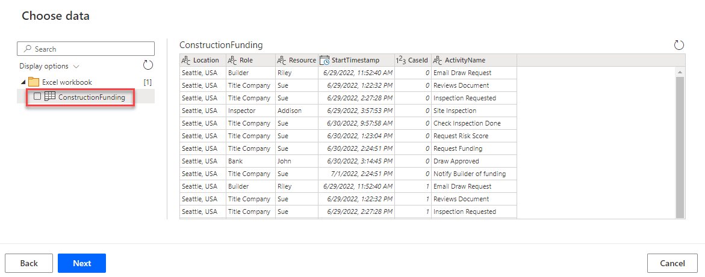

1.  Select **Next**.

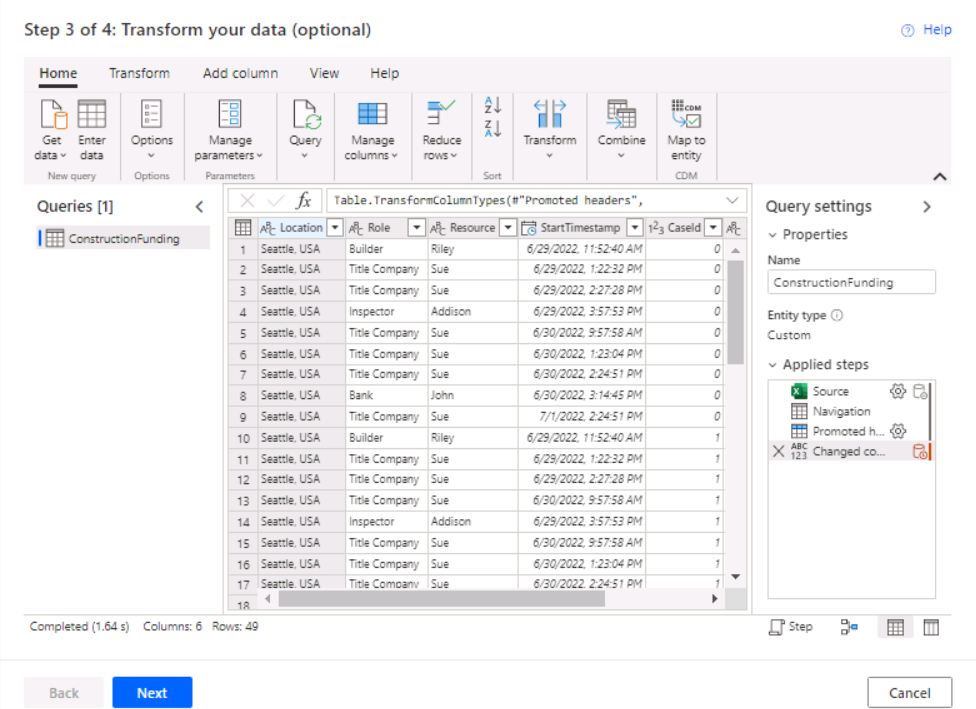

1.  Map the mandatory fields. For each **Event Level Attribute** drop-down,
    select as follows:

    -   StartTimestamp: **Event Start**

    -   CaseId: **Case ID**

    -   ActivityName: **Activity**

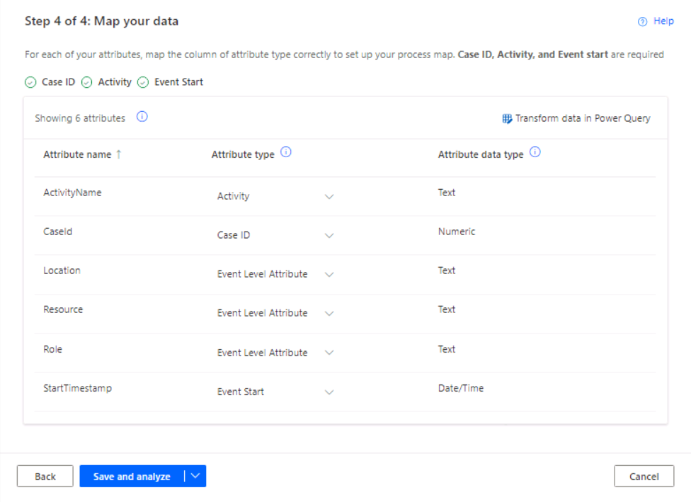

1.  Select **Save and analyze**.

2.  **Wait** for the analyzing to complete.

**Task 2: Review analytics**

1.  The produced process map should look similar to the image below.

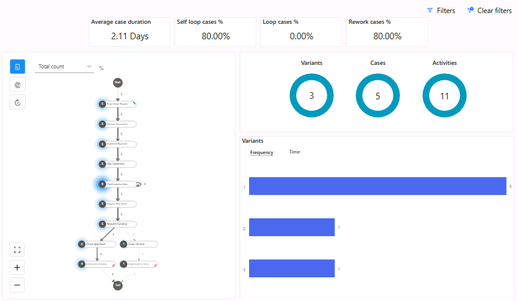

1.  Zoom in to find the **Request Funding** activity. Notice there is a path or
    variant for approved draw and a different one for denied draw.

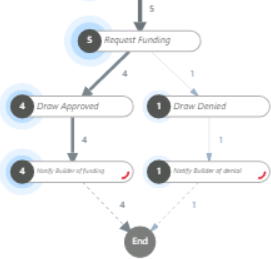

1.  Go to the **Variants \> Frequency** chart and select the bar with the
    highest frequencies. This is the most common path the process takes; in our
    case this is the **Draw Approved** path.

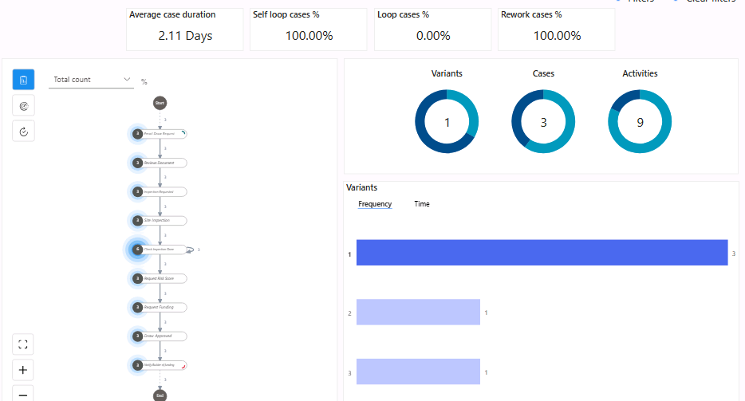

1.  Go to the **Variants \> Frequency** chart and select the second bar. This is
    the frequency for the approved draw path.

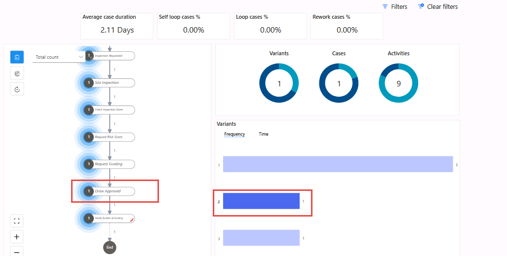

1.  Select the last bar. This is the frequency for the denied draw.

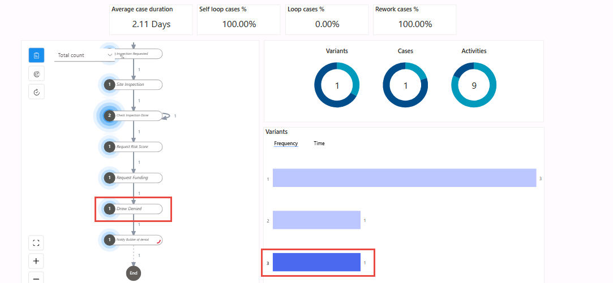

\> \*\*Note:\*\* These Power BI charts allow drilling down on a specific data
point and filtering.

**Exercise \# 3 – Use Process Mining with Recording**

In this exercise, you will perform task analysis by recording using the
Woodgrove Bank Funding Manager application, add activities, and then analyze it.

**Task 1: Create process advisor**

1.  Navigate to
    [https://make.powerautomate.com](https://make.powerautomate.com/) and make
    sure you are in the **Dev** environment.

2.  Select **Process mining** and select **+ Start here**.

1.  Enter **Loan Funding - Recording** for Process name, select **Recordings**,
    and select **Continue**.

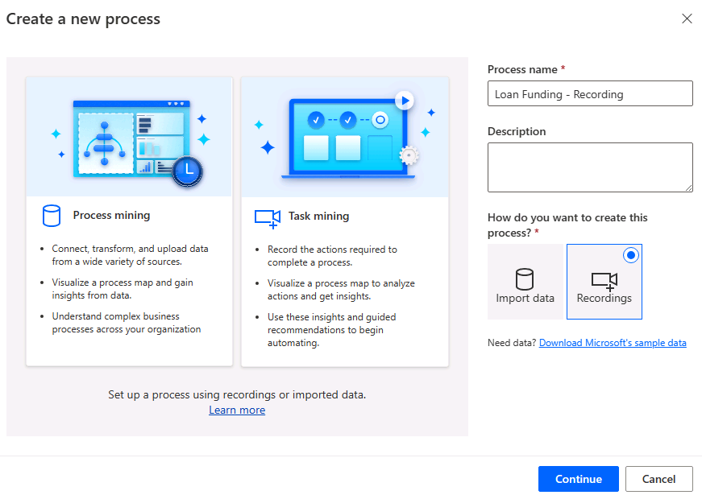

1.  Select **Add a recording**.

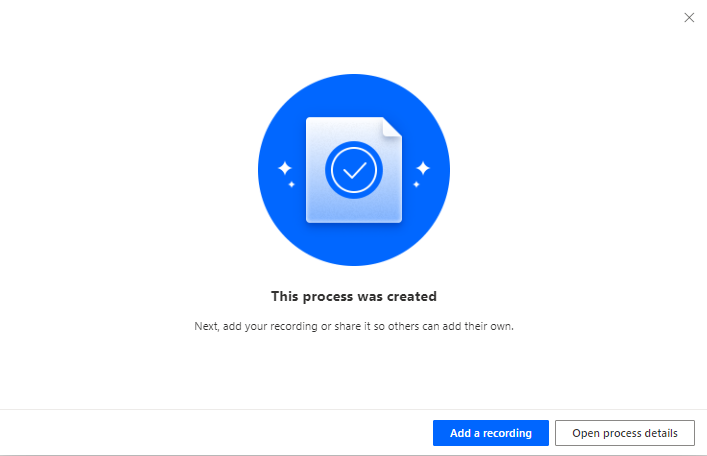

1.  Power Automate desktop should launch. The browser may prompt "This site is
    trying to open Power Automate Designer", select **Open**.

2.  Do not start recording yet.

**Task 2: Record process**

Before you start recording, you should familiarize yourself with the
application, so the recording goes smoothly.

1.  Minimize or close all windows except Power Automate Desktop.

2.  Go to the Start menu and launch the **Woodgrove Bank Funding Manager**
    application. If not displayed, go to the lab resources folder
    (C:\\Labs\\Resources\\Funding manager app) and launch from there.

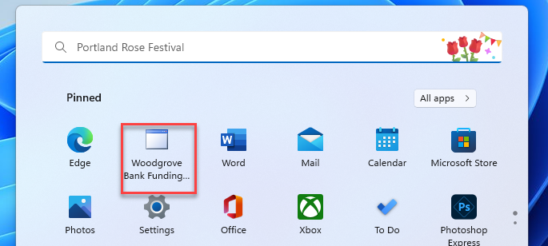

1.  Enter your name for username, pass@word1 for password and select **Login**.

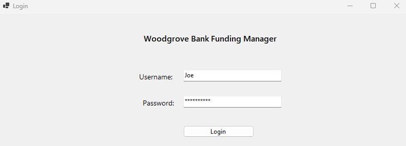

1.  Enter **JG7165** for Loan number and select **Lookup**.

2.  Select **Draw Funds**.

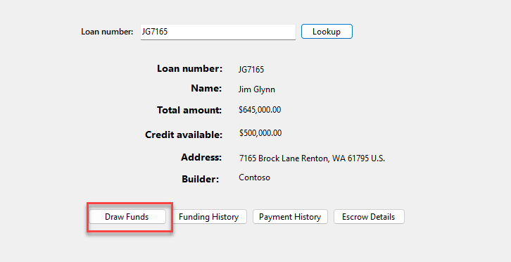

1.  Enter 100000 for **Amount**, 12345 for **Inspection job number**, 65 for
    **Risk Score**, check the **Borrower Approved Draw** checkbox, and select
    **Draw Funds**.

1.  Select **OK**.

2.  Repeat steps **4 to 7** a few more times or until you feel comfortable with
    using the funding application.

3.  You are now ready to record. Go to the recorder and select **Record**.

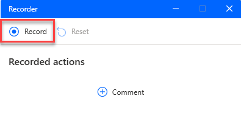

1.  Go to the funding application and repeat steps **4 to 7**.

2.  On the recorder, select **Finish**.

3.  Select **Got it** and return to Power Automate web portal, select **View
    recording**.

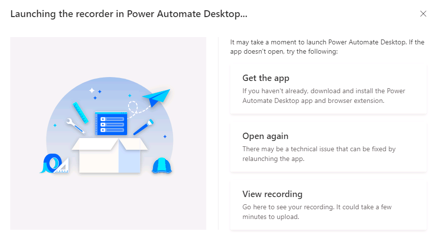

1.  The recording should look like the image below. You can delete and record
    again if you are not happy with recoding.

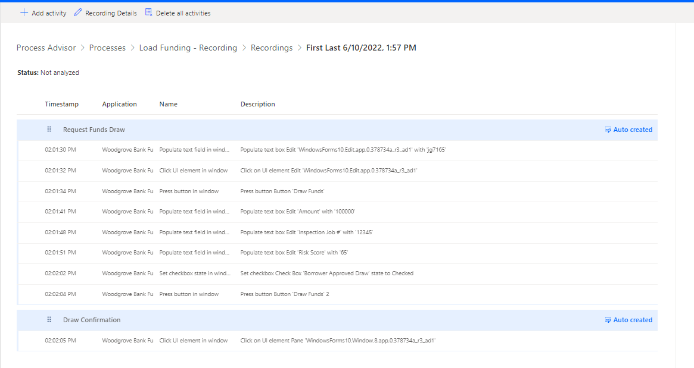

1.  Select each action and examine the action details.

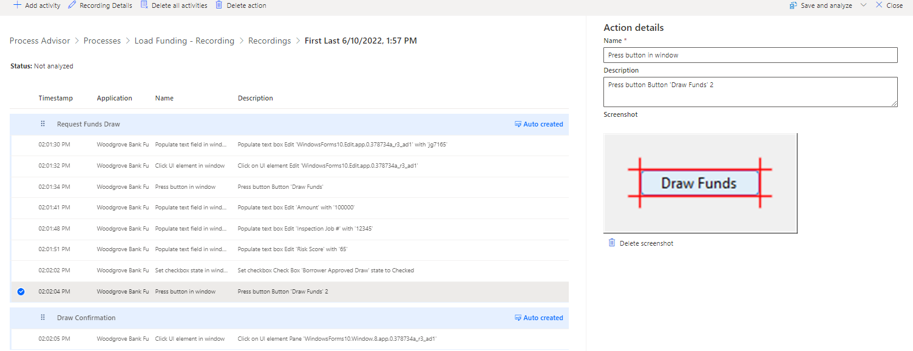

1.  Notice the auto-created activities.

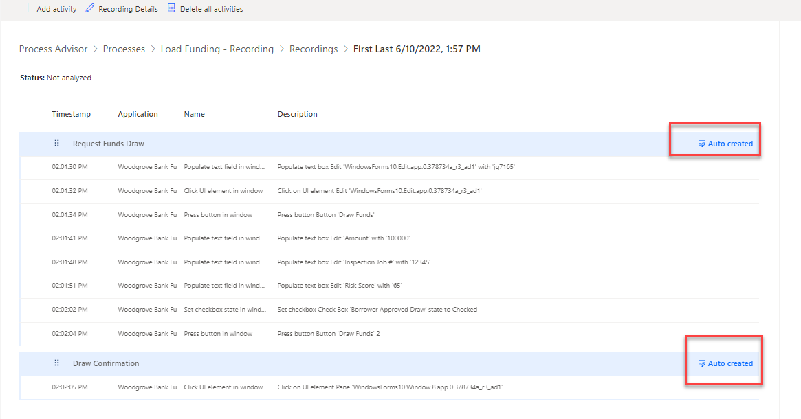

1.  We will delete these auto-created activities and create our own in the next
    task.

2.  Do not navigate away from this page.

**Task 3: Create activities**

In this task, you will group actions into activities.

1.  Navigate to the process by clicking on the name of the process.

1.  Select **Create activity names**.

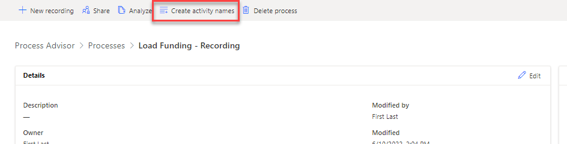

1.  Select **+ New name**.

2.  Enter **Lookup** and select **+ New name** again.

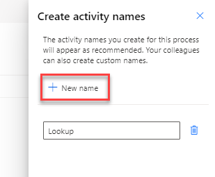

1.  Enter Draw Request and select **+ New name** again.

2.  Enter Approve and select **+ New name** one more time.

3.  Enter Fund and select **Save**.

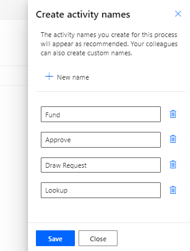

1.  **Close** the create activity names pane.

2.  Go to the **Recordings** section and select to open the recording.

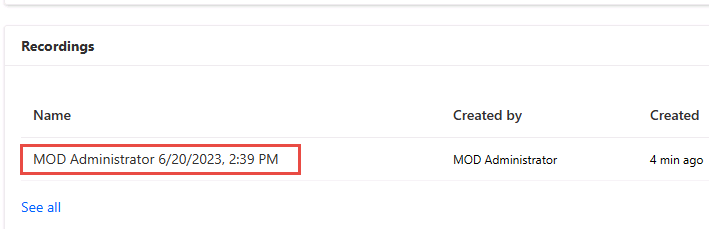

1.  Select **Delete all activities**.

1.  Select **Delete**.

2.  Select **+ Add activity**.

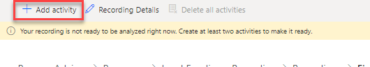

1.  Select the **Name** drop-down and choose **Lookup**.

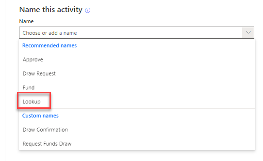

1.  The Lookup activity will be added.

2.  Select **+ Add activity** again.

3.  Select the **Name** drop-down and choose **Draw Request**.

4.  The Draw Request activity will be added.

5.  Select **+ Add activity** again and add **Approve**.

6.  Select **+ Add activity** one more time and add **Fund**.

7.  You should now have 4 activities added.

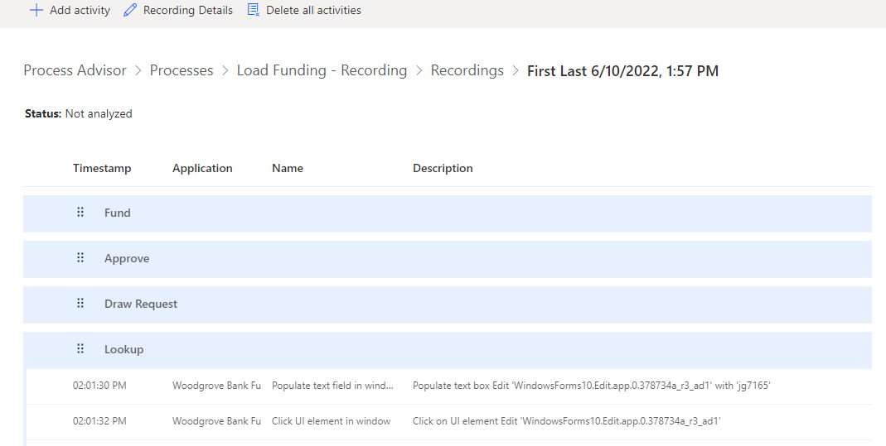

1.  Drag the **Draw Request** activity and place it below the second action. You
    are combing the first two actions into one **Lookup** activity.

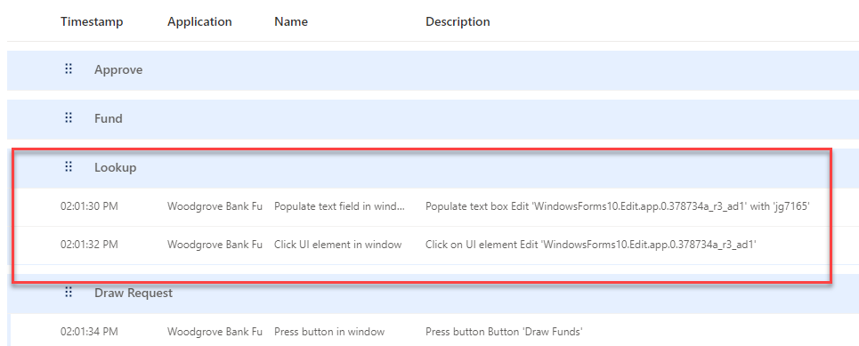

1.  Drag the **Fund** activity and place it below the **Draw Funds** action.

2.  Drag the **Approve** activity and place it below the **Draw Funds 2**
    action.

3.  The activities should now look like the image below.

1.  Select **Save and analyze**.

2.  **Wait** for the process to be analyzed.

3.  Do not navigate away from this page.

**Task 4: Review analytics**

1.  Select **View analytics**.

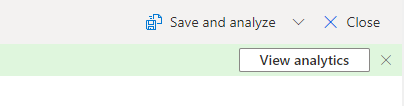

1.  The process should look like the image below.

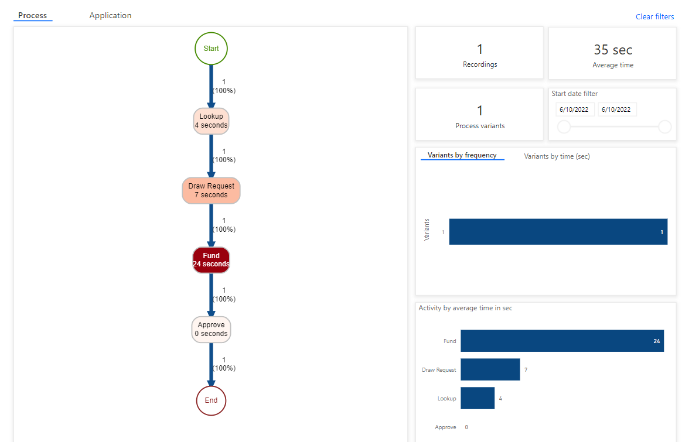

1.  Select the **Application** tab and review it.

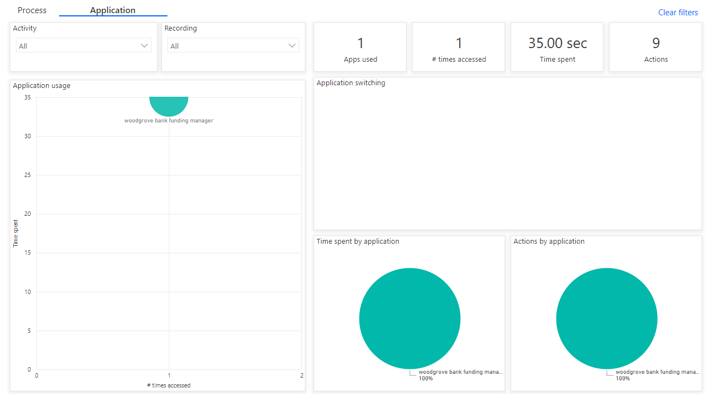

**Exercise \# 4 – Evaluate Automation Options**

When you automate a process, you want to use the most efficient and reliable
means of automation possible. In this exercise you will re-review what you know
about the process and what should be automating an app and what should use an
API.

**Task 1: Review and make notes of what should use an app and what should be a
connector**

A discovery process has been completed by the project team. The following is the
original scenario with our notes from the discovery added.

Woodgrove Bank does construction loans to builders to build homes. Woodgrove
does not give all the loan money to the builders on initial approval they only
give it as construction progresses. Each month, builders can request loan funds
(a draw) for the progress made and funds spent during the last month.

Woodgrove is too busy to manage the process, so they hired Relecloud to manage
it. Each month builders email forms requesting funds to Relecloud. After review,
Relecloud requests Fabrikam Inspections via their website to do an onsite
inspection to verify the work stated was actually done. *During discovery we
learned that Fabrikam has no plans to offer an API*.

Once the inspection is completed, Relecloud does a risk check using a website A
Datum has that confirm that the builder hasn’t become high risk. *During
discovery we learned A Datum has a RESTful API for the risk check*.

After these checks, Relecloud uses a Windows form app provided by Woodgrove to
request funding. Someone from Relecloud checks the app each day for any
completed requests and then they notify of funding completed. *During discovery
we learned that Woodgrove plans to modernize the app in the future*.

Today Relecloud does each process step manually. You have been asked if you can
improve the process by automating some of the process.

**Exercise \# 5 – Design the automation**

In this exercise, you will review the design the team came up with. In the rest
of this course, you will be building out this automation.

**Task 1 – Review the process diagram**

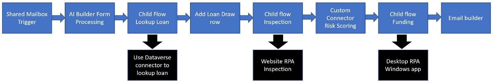

**Task 2 – Review design notes**

-   A shared mailbox will be used to not be dependent on individual users

-   Dataverse tables will be used instead of Excel worksheets to track the
    process. There will be a Loan, Loan Draw and Inspection Photo tables.

-   Child flows will be used for Lookup, Inspection and Funding to keep the main
    cloud flow maintainable.

-   Inspection website will be automated with an unattended desktop flow which
    will include a JSON array of work site photos.

-   The inspection child flow will run the inspection desktop flow and then
    download and persist the work site photos to the Dataverse table.

-   A custom connector will be built for A Datum’s Risk API.

-   The Woodgrove Funding Manager Windows app will be automated with a desktop
    flow.

**Exercise \# 6 – Import starting solution**

In this exercise, you will import a solution into your dev environment, review
the components in the solution, run a cloud flow that will add test data to your
environment, and run the loan manager app included in the solution.

**Task 1: Import solution**

1.  Navigate to https://make.powerapps.com and make sure you are in the **Dev**
    environment.

2.  Select **Solutions** and select **Import solution**.

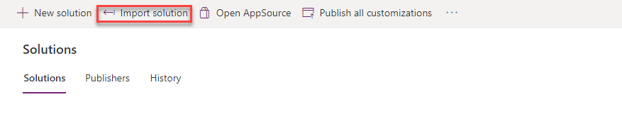

1.  Select **Browse**.

2.  Select the **ConstructionFunding** solution file located in the lab
    resources folder and click **Open**.

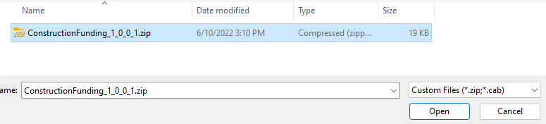

1.  Select **Next**.

2.  Select **Next** again.

3.  Wait for the listed connection to sign in automatically and show a green
    check.

4.  Select **Import** and wait for the import to complete.

5.  You will get a notification when the import completes.

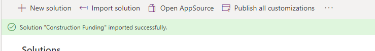

1.  Select **Publish all customizations** and wait for the publishing to
    complete.

1.  Do not navigate away from this page.

**Task 2: Review components**

1.  Open the recently imported **Construction Funding** solution.

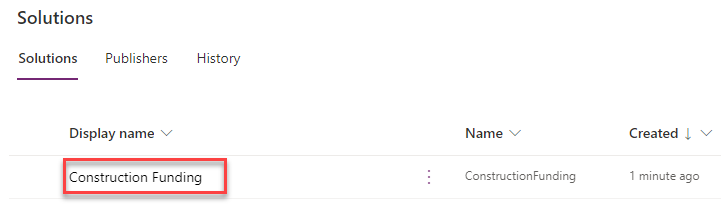

1.  The solution should have several components including 1 application, 1 cloud
    flow, 1 connection reference, 1 sitemap, and 3 tables.

2.  Expand **Tables**, expand the **Loan** table and select **Columns**.

3.  Review the columns for this **Loan** table.

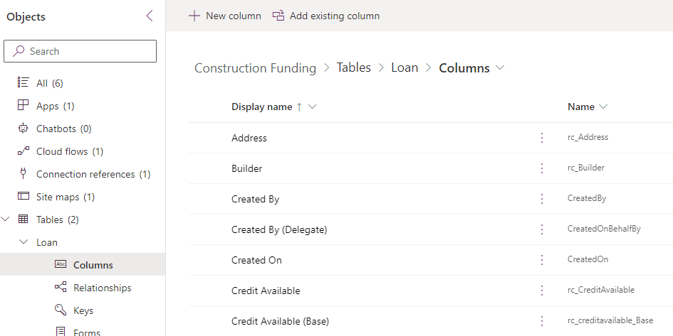

1.  Expand the **Loan Draw** table and select **Columns**.

2.  Review the columns for this **Loan Draw** table.

3.  Select **Cloud flows** and open the **Create Test Data** cloud flow.

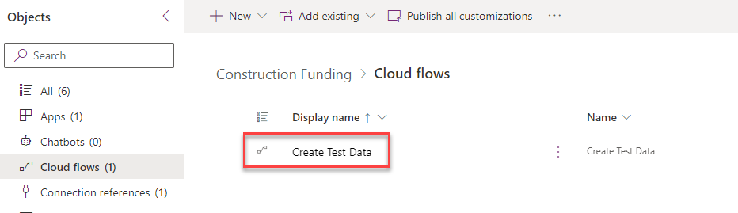

1.  Select **Edit**.

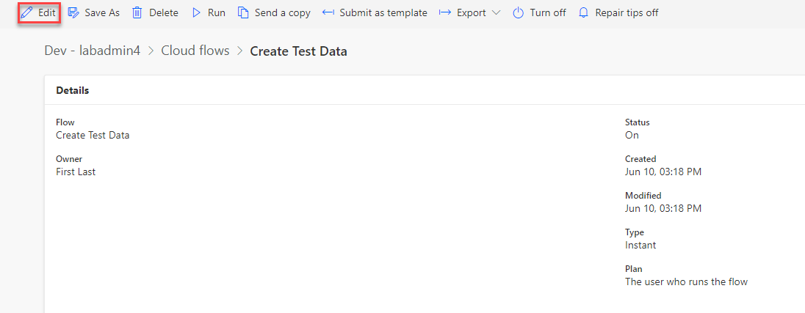

1.  Expand the **Parse JSON** step and review the data that will be added to
    your environment.

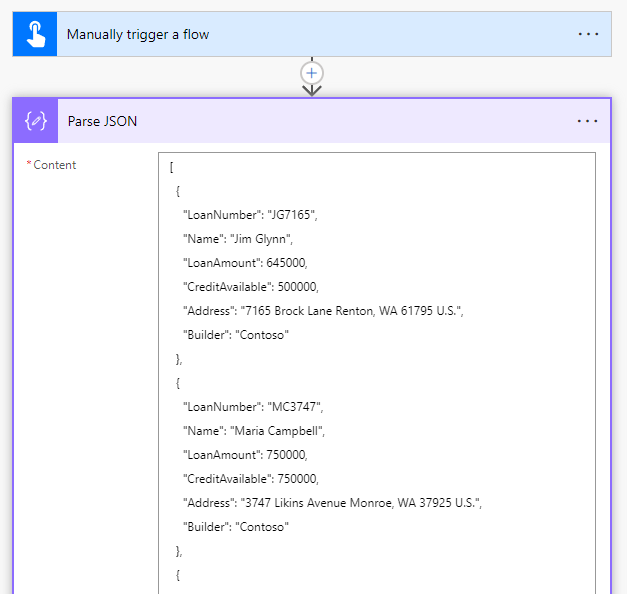

1.  Select the back button.

2.  Do not navigate away from this page.

**Task 3: Run flow**

1.  Select **Cloud flows** and select **Details** to open the **Create Test
    Data** cloud flow.

1.  Select **Run**.

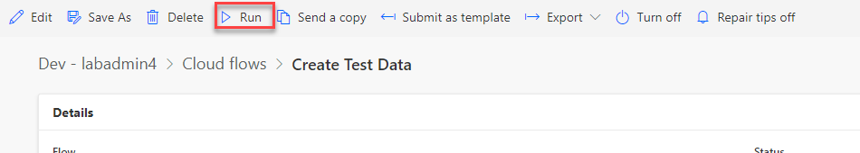

1.  Select **Run flow**.

2.  Select **Done**.

3.  **Wait** for the flow run to complete.

4.  Select the refresh button until you see the success message.

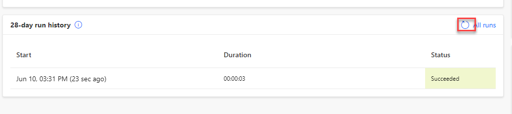

**Task 4: Run loan manager app**

1.  Navigate to https://make.powerapps.com and make sure you are in the **Dev**
    environment.

2.  Select **Apps** and launch the **Loan Manager** application.

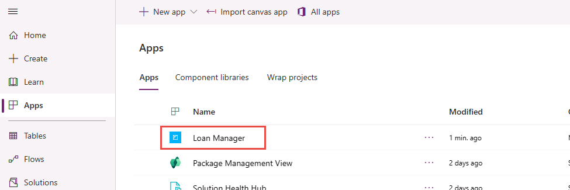

1.  You should see the data added by the cloud flow. Open one of the loan
    records.

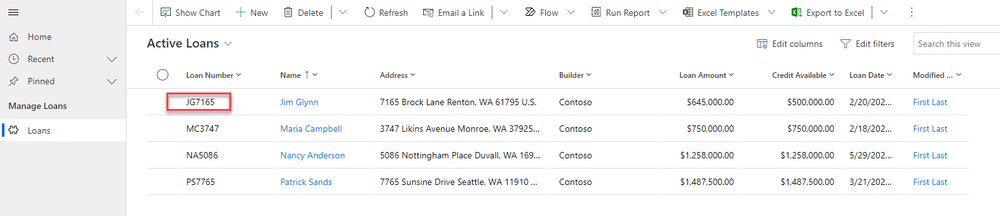

1.  Review the loan.

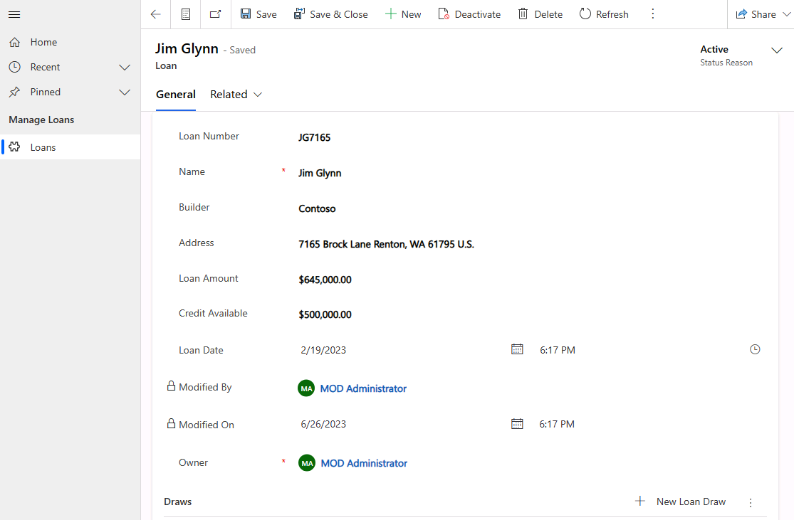
